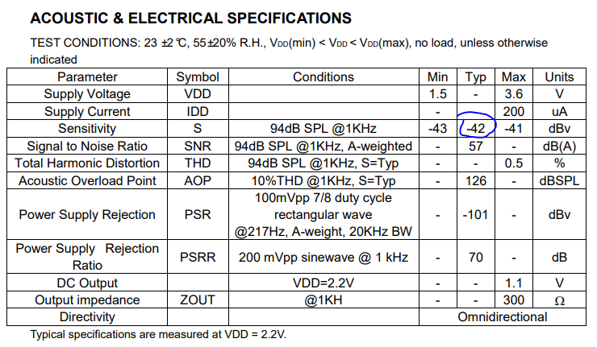

语音准入测试
########################

本文档介绍关于语音准入的测试项目与准入标准
   
.. caution::  
    为确保接收信号完整，软件需要关闭所有算法及EQ（算法会对噪声消除，EQ可能加入高低通滤波器），关闭算法EQ下进行语音准入测试（自播自录、MIC密封性、MIC灵敏度一致性）

- 自播自录_
- MIC密封性_
- MIC灵敏度一致性_
- MIC丢包测试_

自播自录
**************************

1. 测试准备
==============

- 设备：样机，CRY dongle，音源，电脑

- 软件：Adobe Audition CC，CRY574PRO

- 环境：消音房
    

2. 测试方法
==============

- CRY dongle 连接样机，并打开 HFP 模式，样机正常平放桌面

    
- Audition 音频硬件设置输入、输出为 CRY574Pro A

- 新建音频文件，开始播放录制

.. figure:: ../images/voice/adc_admission/Win_set.png
    :width: 500px
    :align: center

3. 测试标准
==============

- Audition 分析自播自录扫频测试数据，其曲线光滑完整，且没有谐波为PASS标准

4. 附件
==============

- 音源文件：`sweep_log_48k_3db.wav`_

MIC密封性
**************************

1. 测试准备
==============
    
- 设备：样机，兆华/AP    

- 软件：ATC2.0

- 环境：消音房

2. 测试方法
==============

- 蓝牙连接被测耳机，输入正弦波扫频信号，录制曲线A，用胶泥堵mic出音孔后录制曲线B

3. 测试标准
==============

.. important::  
    曲线A-曲线B 需大于 **15dB**

MIC灵敏度一致性
**************************

1. 测试准备
==============
    
- 设备：样机，兆华/AP    

- 软件：ATC2.0

- 环境：消音房

2. 测试方法
==============

- 满量程标准获取

2.1 计算法

根据AD6976D芯片 Mic 增益级设为 13 对应通路的增益实际上是24dB，在24dB下对应输入幅度是90mVpp
目前我们使用的mic灵敏度为-42dBV @94dB 1kHz

经计算：
若软件设置模拟增益级为13，理论mic接收到的幅值应为：

``-42+20*log（0.09/2/1.414） = -12.05dBFS``

2.2 测量法

软件增益设置正常，去掉MIC飞线出来连接到AP上，AP给一个 -42 dbV 信号

- 录音增益值

蓝牙连接被测耳机，用标准音源播放1kHz 94dB的声音，用耳机mic录音，查看增益量

3. 测试标准
==============

.. important::  
    测试时加入模拟增益级13
    理论测试结果为-12.05dBFS
    理论结果与实测数据差异小于 2dB 为PASS

.. figure:: ../images/voice/adc_admission/mic_t4.png
    :align: center

MIC丢包测试
**************************

1. 测试准备
==============
    
- 设备：样机，AP/CRY dongle、电脑

- 软件：ATC2.0/Adobe Audition CC、CRY574PRO

- 环境：消音房
    

2. 测试方法
==============

蓝牙连接被测耳机，用标准音源播放1kHz 80 - 85dB的声音，用耳机mic录音（或可拆掉MIC，飞线通过AP直接输入1kHz 满量程信号）

- AP 录音

2.1 AP -  bench mode

2.2 AP -  Input/Output

2.3 AP -  Recorder Start

- CRY 录音

CRY 连接耳机 HFP 模式，使用 Adobe Audition CC 进行录音。

3. 测试标准
==============

.. important::  
    分析录制的音频文件，连续两次的丢包超过 60S 为PASS

.. _`sweep_log_48k_3db.wav`: ../../../attachment/adc_mission/sweep_log_48k_3db.wav