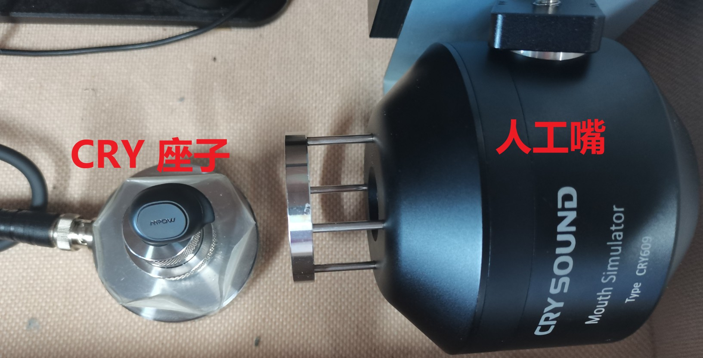
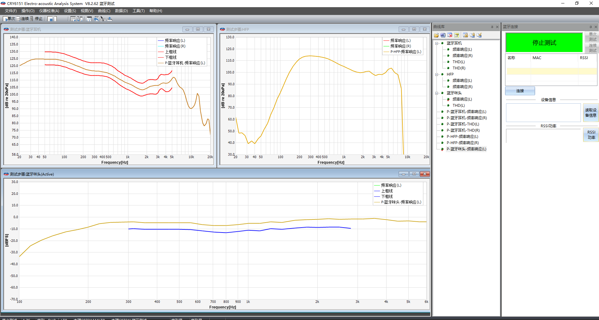
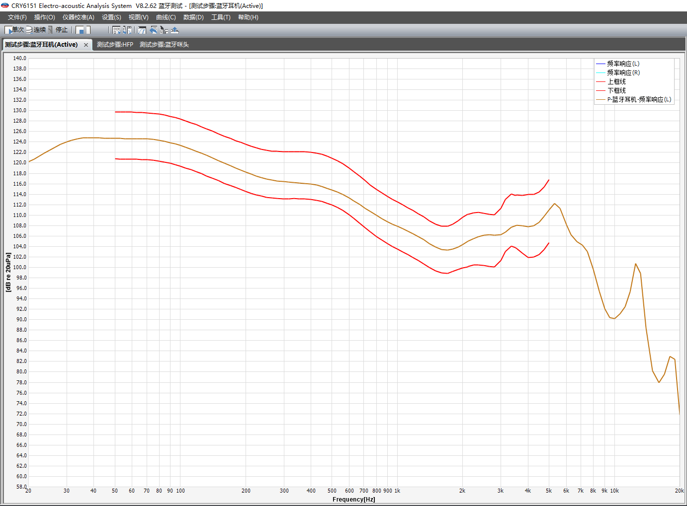
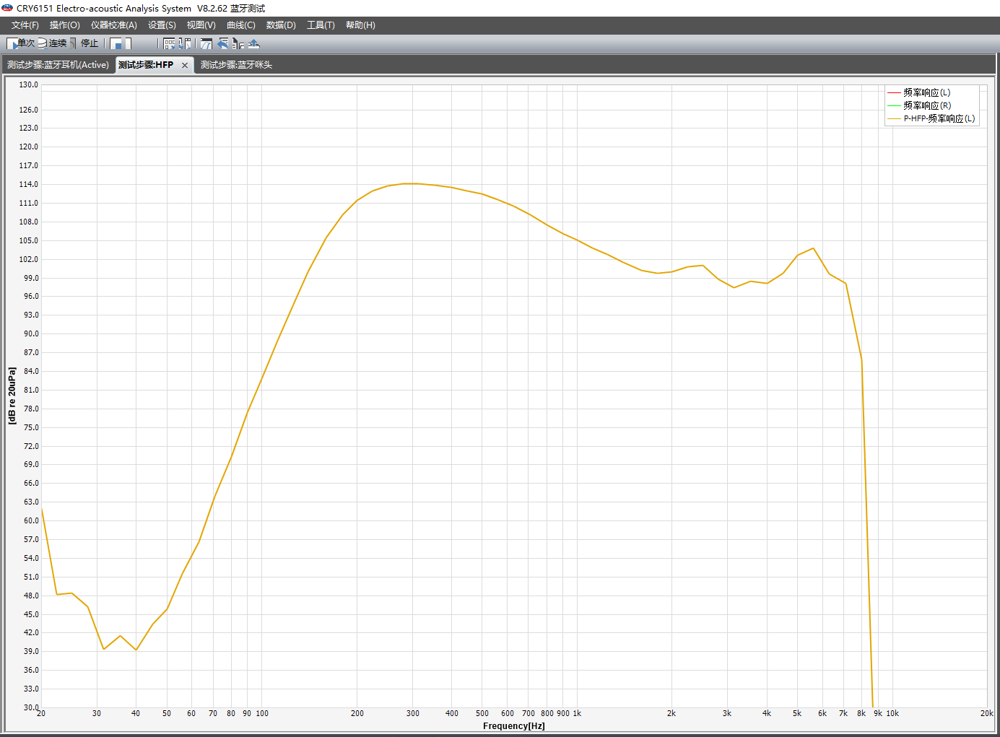
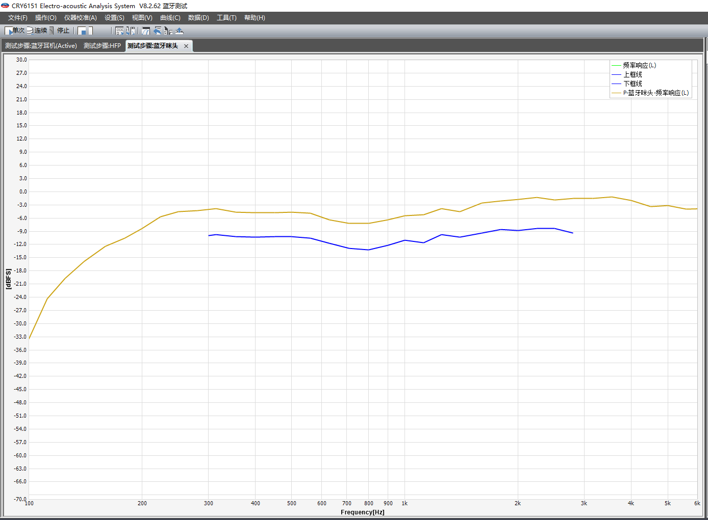
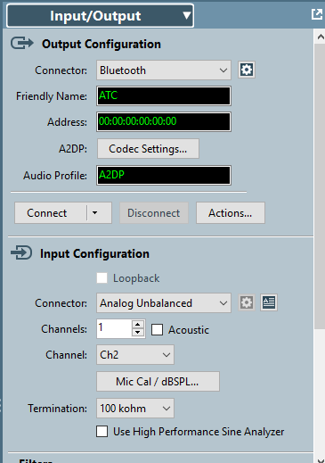
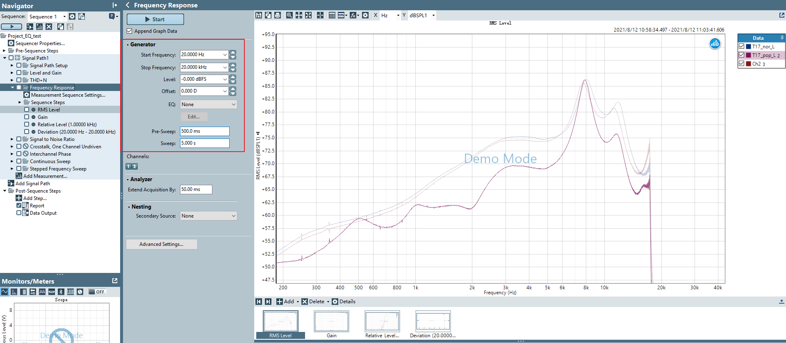
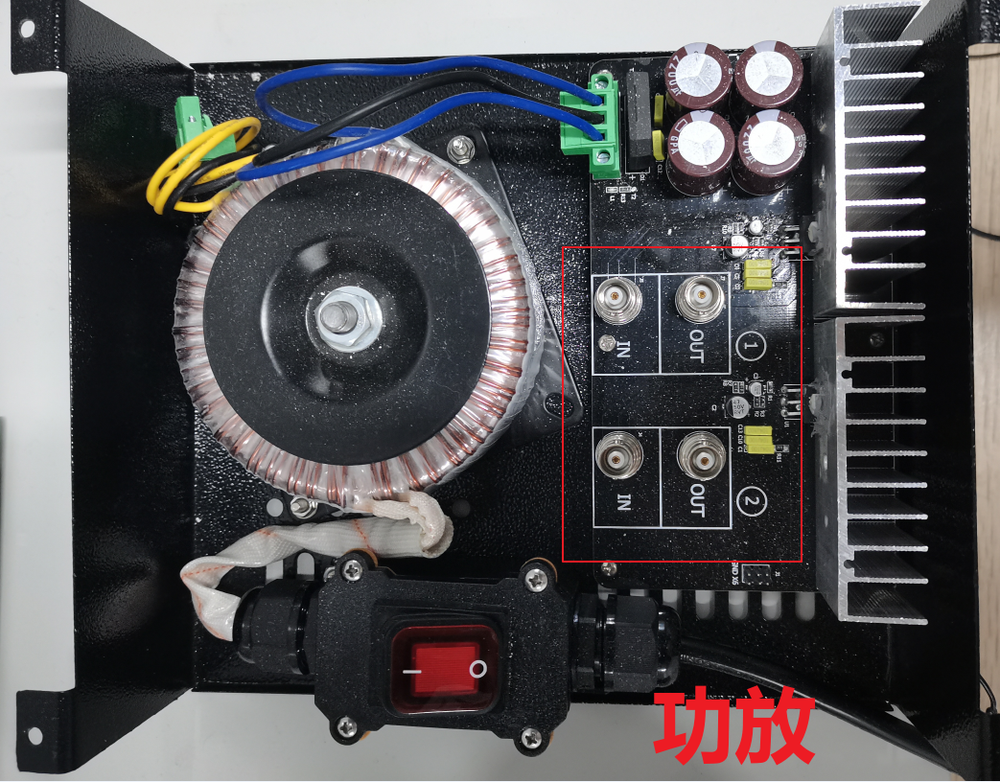
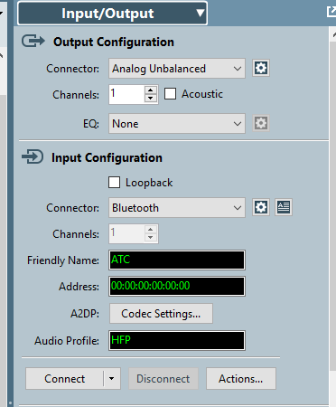
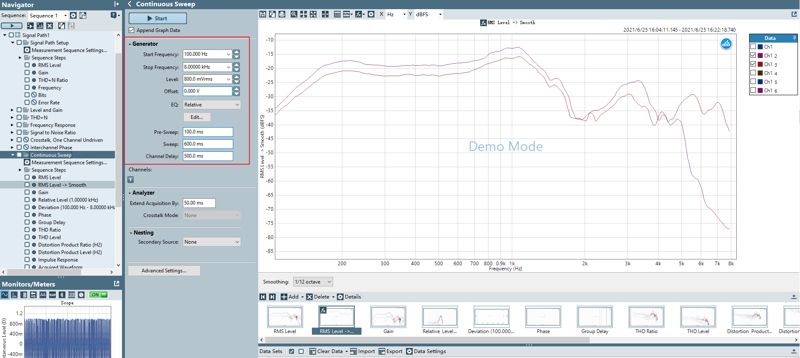

声学曲线测试
########################

本文档介绍关于声学曲线的测试
   

- CRY_
- AP_

CRY
**************************

1. 测试准备
==============

- 设备：样机，CRY 测试箱，人工嘴

- 软件：CRY6151

- 环境：消音房

2. 测试方法
==============

- CRY 测试箱
    输入：蓝牙耳机

    输出：人工嘴

- 连接
    样机开机放置 CRY 座子 （用模具或橡皮泥密封好）。

    CRY 测试箱 **输入** 连接蓝牙耳机，CRY 测试箱 **输出** 连接人工嘴对准样机mic端。
    
    测试模板可参照 ``T8P6972A.zip``

3. A2DP、MIC上下行曲线测试
============================

- 测试整体界面

- A2DP

- Mic下行（HFP）

- Mic上行

AP
**************************

1. 测试准备
==============

- 软件：ATC2.0

- 环境：消音房

2. A2DP、MIC下行曲线测试
============================

- 测试设备：样机，AP，CRY座子

- AP
    输入：Analog Unbalanced

    输出：蓝牙耳机

- 连接
    样机开机放置 CRY 座子 （用模具或橡皮泥密封好）。

    AP **输入** Analog Unbalanced 连接 CRY 座子，AP **输出** Bluetooth 连接样机。

- Actions
    通过  Actions 开启/关闭 Sco 来切换 Audio Profile 连接的是 A2DP 还是 HFP。从而测试 A2DP / MIC 下行曲线。

.. important::  
    连接完毕，播放扫频开始测试。扫频波参数可参考如下。

3. MIC上行曲线测试
============================

- 测试设备：样机，AP，CRY座子，功放，人工嘴

- AP
    输入：Analog Unbalanced

    输出：蓝牙耳机

- 连接
    样机开机放置 CRY 座子 （用模具或橡皮泥密封好）。
    
    AP **输入** Bluetooth 连接样机，AP **输出** Analog Unbalanced 到 功放 再到人工嘴。

- Actions
    通过  Actions 开启 Sco 确认 Audio Profile 连接的是 HFP。

.. important::  
    连接完毕，播放扫频开始测试。扫频波参数可参考如下。

.. caution::
    若出现高频衰减问题，请留意 SDK 中 CONST_SPLIT_FILTER_MODE 是否开启 ，与 AEC 初始化时 AGC_echo_look_ahead 参数是否为 0 。

